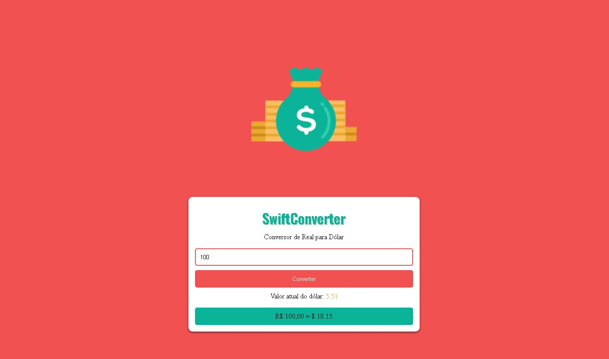

# SwiftConverter 
## Descrição

**SwiftConverter** é um conversor de moedas simples e rápido que permite a conversão de valores em Real (BRL) para Dólar (USD). O projeto é desenvolvido utilizando HTML, CSS e JavaScript, e faz uso da API AwesomeAPI para buscar o valor atual do dólar, garantindo que as conversões sejam sempre precisas e atualizadas.

## Funcionalidades

- Conversão de valores de Real para Dólar em tempo real.
- Busca automática do valor atual do dólar.
- Interface amigável e responsiva.
- Design clean e moderno.

## Tecnologias Utilizadas

- **HTML5**: Estrutura básica do site.
- **CSS3**: Estilização da interface do usuário.
- **JavaScript**: Lógica de conversão e interação com a API.
- **API AwesomeAPI**: Para obter o valor atual do dólar.

## Como Usar

1. Clone o repositório:
   ```bash
   git clone https://github.com/caioreis2994/SwiftConverter.git
   cd SwiftConverter
   ```
2. Abra o arquivo index.html em seu navegador.
3. Digite um valor em reais no campo de entrada.
4. Clique no botão "Converter" para ver o resultado.

## Exemplo do Uso
<p align="center">
  
</p>

## Contribuições
Contribuições são bem-vindas! Sinta-se à vontade para abrir um issue ou enviar um pull request.

## Licença
Este projeto está licenciado sob a MIT License.

## Contato

- **GitHub**: caioreis29974
- **Instagram**: @caio.xyz_
